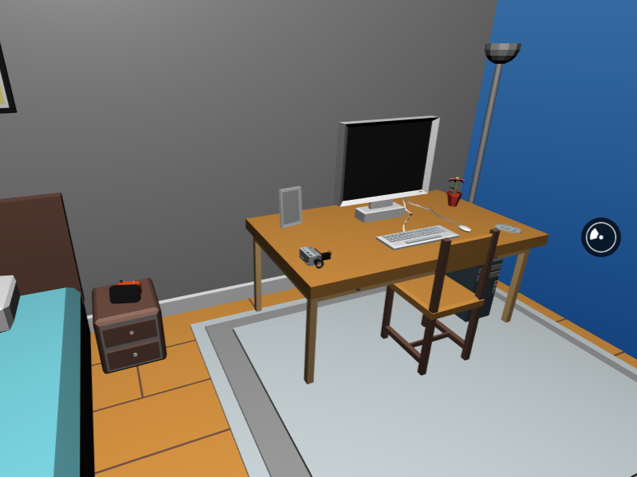

import { syntaxHighlighterPrism, dark as theme } from 'mdx-deck/themes';
import {
  Image,
} from '@mdx-deck/components';

export const themes = [syntaxHighlighterPrism, theme];

# react-360-room


---

## Conteúdo
- O que é o React360?
- O projeto
- Elementos 2D: Surface/View
- Elementos 3D: Location/Entity
- Iluminação
- Interação
- Áudio

---

## O que é o React360?
- Framework multiplataforma para interfaces VR e mídia 360 
- Anteriormente chamado de ReactVR
- React + React Native + THREE.js

---

## O projeto: 

### react-360-room

vspedr.github.io/react-360-room

github.com/vspedr/react-360-room

---

## Elementos 2D:
### Surface

Suporta superfícies planas ou cilíndricas

```javascript
AppRegistry.registerComponent('MyAppName', () => MyAppName);

r360.renderToSurface(
  r360.createRoot('MyAppName', {/* initial props */}),
  r360.getDefaultSurface(),
  'default' /* optional, a name to reference the surface */
);
```

---

```javascript
<View style={styles.box} />
  <Text>Hello from React360!</Text>
</View>

// ...

const styles = StyleSheet.create({
  panel: {
    // Fill the entire surface
    width: 1000,
    height: 600,
    justifyContent: 'center',
    alignItems: 'center',
  },
});
```

---

## Elementos 3D:
### Location

Localização em relação a um ponto de referência 3D (X, Y, Z)

```javascript
AppRegistry.registerComponent('Room', () => Room);

  r360.renderToLocation(
    r360.createRoot('Room'),
    r360.getDefaultLocation(),
  );
```

---

```javascript
<Entity
  lit // Permite iluminação nas superfícies
  source={{
    obj: asset('model.obj'),      // forma do objeto
    mtl: asset('materials.mtl'),  // textura do objeto
  }}
  style={{
    transform: [
      { translateX: -1.0 },
      { translateY: -1.0 },
      { translateZ: -0.5 },
      { rotateY: 90 },
    ],
  }}
/>
```

---

## Interação

```javascript

handleClick = () => {
  doSomething();
  this.setState({ foo: 'bar' });
}

// ...

<VrButton onClick={this.handleClick}>
```

---

## Iluminação

Luz ambiente, direcional, entre outros...

```javascript
<AmbientLight intensity={this.state.lightsOn ? 1.0 : 0.5} />
<PointLight
  style={{
    transform: [
      { translateY: 2.0 },
    ],
  }}
  intensity={this.state.lightsOn ? 1.0 : 0.5}
/>
```

---

## Áudio

```javascript
import { NativeModules } from 'react-360';
const { AudioModule } = NativeModules;

// ...

AudioModule.createAudio('jazz', {
  source: asset('bensound-thejazzpiano.mp3'),
  is3d: true,
});
AudioModule.play('jazz', {
  position: [-3, 0, 0],
  loop: true,
  volume: 0.3,
});

```

---

## Dúvidas?


---

## Obrigado!


github.com/vspedr
